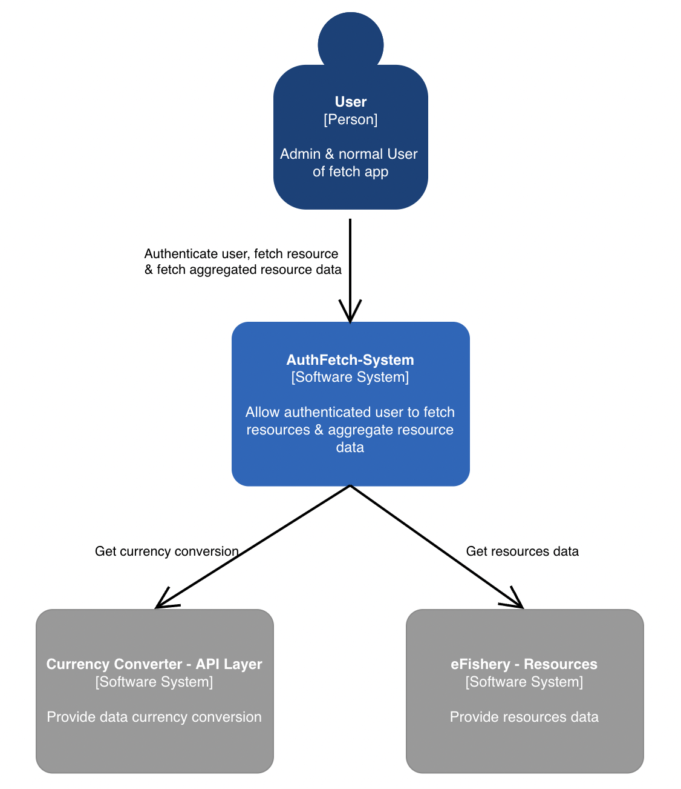

# Quickstart Guide to Set up Dev Workspace

1. Git clone git@github.com:mrmurazza/auth-fetch-app.git
2. Make sure you have Docker installed.
3. Rename `.env.example` file to `.env` for each of `authapp` & `fetchapp`.
4. Adjust the `.env` value.
5. Run docker compose to run the service in you local device
   `$ docker compose up`
6. `authapp` will by default use port `8080` and `fetchapp` will use port `5000`. You need to update the port in docker-compose.yml to change it.

# Context Model


# Container Model


# Project Structure

## Auth App
```
.
├── config                          > contains config file that reads from env variable
├── domain                          > contains the main business logic grouped by its domain
│     └── user                      
│        ├── impl                   > contains class implementation of service & repo
│        ├── entity.go              > file contains domain model and data object related to the domain 
│        └── type.go                > file contains interface declaration of service & repo
├── dto                             > contains data object used in endpoint requests & response
├── handler                         > contains handler class responsible to handle inputs from external to domain & parsing response from domain to external
├── pkg                             > contains package or util class used by the domain
├── main.go                         > Main Go file
├── authapp.db                      > SQLite DB file
└── Dockerfile 
```

## Fetch App
```
.
└──src
    ├── clients                      > contains files to handle communication to external parties
    ├── services                     > contains files to handle main business logic 
    ├── controllers                  > contains controllers class responsible to handle inputs from external to services & preparing response to clients
    ├── middlewares                  > contains files of middlewares used in app.js or controllers
    ├── app.js
    ├── server.js                    
    └── Dockerfile 
```

# API Docs

In this GitHub repo provided the API docs using Postman Collection & Postman Environment Variable export files.
The endpoint besides Login will need to bear Authorization with Bearer Token that you get once you log in.

However, using this Postman collection below, your token will be stored in the environment variables once you success Log in, 
so you do not need to manually copy & paste the token to other requests each time after you log in.

[Postman Collection JSON Export File](postman/auth-fetch-app.postman_collection.json)

[Postman Environment Variable JSON Export File](postman/auth-fetch-app.postman_environment.json)

Below some screenshot of the Postman

## Auth App
### Login


### Create User - Admin
![create-user[admin]](postman/screenshot/create-user[ADMIN].png)

### Check Auth


## Fetch App
### Fetch Resource by Admin


### Aggregate Resource by Admin


### Aggregate Resource by User


# Video Demo
Video demo of this app can be accessed in this link https://drive.google.com/file/d/1htWzFSavI5_ZLd4T5LyEkuqdZeN6vKxG/view?usp=sharing